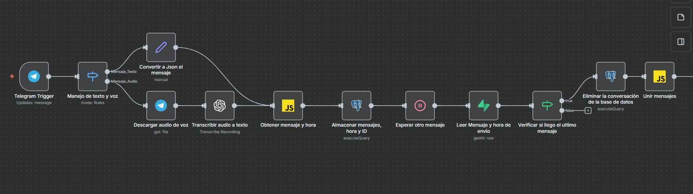
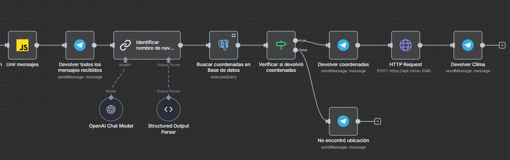
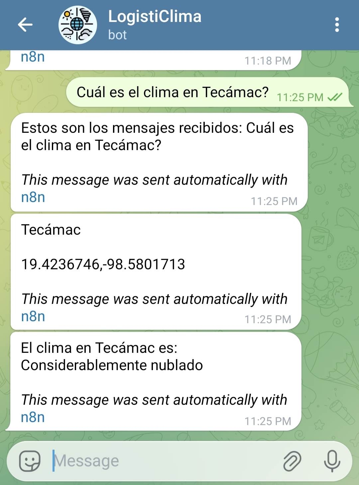
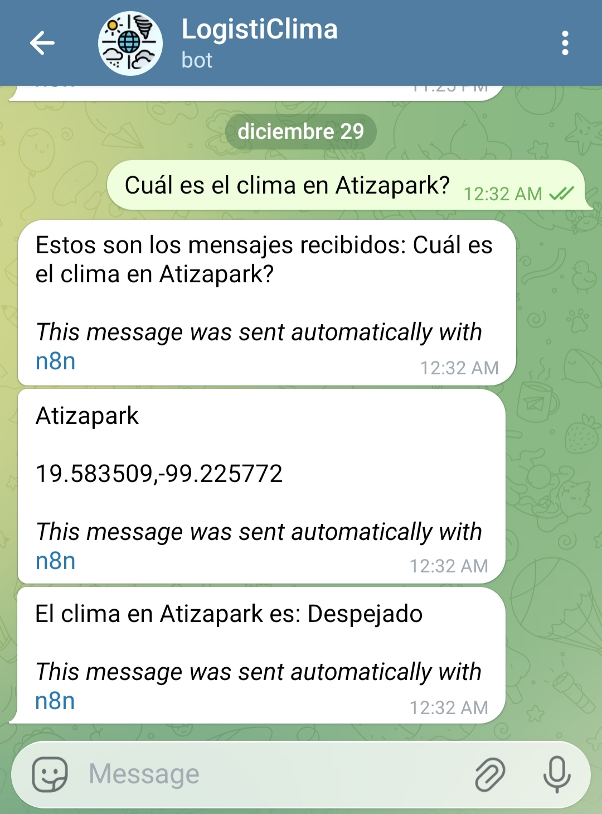

# LogistiClima bot - API de predicción climática

## Descripción del proyecto

**LogistiClima bot** es un sistema de predicción meteorológica integrado con Telegram que permite a los usuarios consultar el clima de municipios y naves industriales mediante mensajes de texto o voz. El proyecto combina un modelo de Machine Learning (Random Forest) con un flujo de automatización en n8n para ofrecer predicciones climáticas en tiempo real.

---

## Estructura del proyecto

```
API_Clima/
├── README.md                    # Este archivo
├── Dockerfile                   # Configuración para contenerización
├── requirements.txt             # Dependencias de Python
├── data/                        # Datos de municipios y naves industriales
│   ├── raw/                     # Datos sin procesar
│   │   ├── CSV_Sucio_Naves.csv
│   │   └── Municipios_Sucios.csv
│   └── processed/               # Datos limpios y procesados
│       ├── Municipios.csv
│       └── Naves_Industriales.csv
├── model/                       # Modelo de ML entrenado para predicción climática
│   └── prediccion_clima.pkl     # Modelo Random Forest
├── notebooks/                   # Notebooks de preprocesamiento
│   ├── Preprocesamiento_municipios.ipynb
│   └── Preprocesamiento_naves.ipynb
└── src/
    ├── api/
    │   └── API_Logisticlima.py  # API REST con FastAPI
    ├── n8n/
    │   └── images/              # Capturas del workflow de n8n
    │       ├── workflow_pt1.png
    │       └── workflow_pt2.png
    └── telegram/
        └── images/              # Capturas de demostración del bot
            ├── Municipio.jpg
            └── Nave_Industrial.jpg
```

---

## Preprocesamiento de datos

El proyecto incluye notebooks de Jupyter para el preprocesamiento de los datos de ubicaciones (municipios y naves industriales). Los datos crudos se encuentran en `data/raw/` y los datos procesados se guardan en `data/processed/`.

### Notebooks disponibles

| Notebook | Entrada | Salida | Descripción |
|----------|---------|--------|-------------|
| `Preprocesamiento_municipios.ipynb` | `Municipios_Sucios.csv` | `Municipios.csv` | Filtra municipios del Estado de México, elimina columnas innecesarias y estandariza nombres de columnas |
| `Preprocesamiento_naves.ipynb` | `CSV_Sucio_Naves.csv` | `Naves_Industriales.csv` | Limpia datos de naves industriales, elimina columnas innecesarias y formatea nombres |

### Estructura de datos procesados

**Municipios.csv:**
| Columna | Descripción |
|---------|-------------|
| `nombre` | Nombre del municipio |
| `lat` | Latitud |
| `lon` | Longitud |

**Naves_Industriales.csv:**
| Columna | Descripción |
|---------|-------------|
| `nombre` | Nombre del parque industrial |
| `latitud` | Latitud |
| `longitud` | Longitud |

---

## API de predicción climática

### Endpoint principal

| Método | Endpoint | Descripción |
|--------|----------|-------------|
| `POST` | `/predecir` | Recibe coordenadas y devuelve la predicción climática |

### Parámetros de entrada

```json
{
  "lat": 19.4326,
  "lon": -99.1332
}
```

### Respuesta

```json
{
  "ubicacion": "Mexico City",
  "prediccion": "Nublado",
  "datos_actuales": {
    "temp": 22.5,
    "humedad": 65
  }
}
```

### Condiciones climáticas predichas

El modelo clasifica el clima en las siguientes categorías:
- Nublado
- Considerablemente nublado
- Despejado
- Niebla
- Bruma
- Lluvia intensa
- Tormenta eléctrica intensa
- Neblina
- Lluvia
- Truenos

---

## Workflow de n8n - Bot de telegram

El sistema utiliza n8n como orquestador para conectar Telegram con la API de predicción. El flujo se divide en dos partes principales:

### Parte 1: Recepción y procesamiento de mensajes



| Nodo | Descripción |
|------|-------------|
| **Telegram Trigger** | Actúa como el punto de inicio, activándose cada vez que un usuario envía un mensaje al bot. |
| **Manejo de texto y voz** | Nodo de tipo Switch que detecta si el mensaje entrante contiene texto o un archivo de audio. |
| **Convertir a JSON el mensaje** | Si es texto, este nodo estandariza el formato para que el resto del flujo lo procese fácilmente. |
| **Descargar audio de voz** | Si es un mensaje de voz, descarga el archivo binario desde los servidores de Telegram. |
| **Transcribir audio a texto** | Utiliza un modelo de OpenAI (Whisper) para convertir el audio descargado en texto procesable. |
| **Obtener mensaje y hora** | Nodo de código que extrae el ID del chat y genera una marca de tiempo (timestamp) para gestionar la sesión. |
| **Almacenar mensajes, hora y ID** | Guarda temporalmente el mensaje en una tabla de PostgreSQL para permitir la acumulación de mensajes. |
| **Esperar otro mensaje** | Pausa el flujo por 10 segundos, permitiendo que si el usuario envía varios mensajes seguidos, todos se agrupen en una sola consulta. |
| **Leer mensaje y hora de envío** | Consulta la base de datos para recuperar todos los mensajes acumulados del usuario específico. |
| **Verificar si llegó el último mensaje** | Nodo IF que asegura que solo la última ejecución del flujo continúe, evitando respuestas duplicadas por cada mensaje corto enviado. |
| **Eliminar la conversación de la BD** | Una vez recuperados los mensajes, limpia el búfer en PostgreSQL para la próxima interacción. |
| **Unir mensajes** | Concatena todos los fragmentos de texto acumulados en una sola cadena de texto lógica. |

---

### Parte 2: Procesamiento con IA y predicción climática



| Nodo | Descripción |
|------|-------------|
| **Devolver todos los mensajes recibidos** | Envía un mensaje de confirmación al usuario con el texto total que el bot va a procesar. |
| **Identificar nombre de nave o municipio** | Es el cerebro del flujo. Utiliza un modelo de lenguaje (LLM) de OpenAI para extraer el nombre del lugar y clasificarlo como "municipio" o "nave_industrial". |
| **OpenAI chat model** | Provee la inteligencia al nodo anterior mediante la API de OpenAI. |
| **Structured output parser** | Asegura que la IA responda en un formato JSON estricto para que el siguiente nodo pueda leerlo correctamente. |
| **Buscar coordenadas en base de datos** | Ejecuta una consulta SQL en PostgreSQL para obtener la latitud y longitud basándose en la clasificación de la IA. |
| **Verificar si devolvió coordenadas** | Nodo IF que valida si la base de datos encontró el lugar solicitado. |
| **Devolver coordenadas / No encontró ubicación** | Nodos de respuesta de Telegram que informan al usuario si se encontró el punto geográfico o si hubo un error. |
| **HTTP request** | Realiza una petición POST a la API (`API_Logisticlima`) enviando las coordenadas obtenidas para generar el pronóstico. |
| **Devolver clima** | Nodo final que entrega al usuario el resultado de la predicción meteorológica generada por el modelo de Random Forest. |

---

## Flujo de Datos

```
Usuario (Telegram)
       │
       ▼
┌─────────────────┐
│ Mensaje de voz  │──► Whisper (OpenAI) ──► Texto
│   o texto       │
└─────────────────┘
       │
       ▼
┌─────────────────┐
│ Buffer temporal │◄── PostgreSQL
│  (10 segundos)  │
└─────────────────┘
       │
       ▼
┌─────────────────┐
│   OpenAI LLM    │──► Extrae: nombre + tipo (municipio/nave)
└─────────────────┘
       │
       ▼
┌─────────────────┐
│   PostgreSQL    │──► Busca coordenadas (lat, lon)
└─────────────────┘
       │
       ▼
┌─────────────────┐
│ API_Logisticlima│──► WeatherAPI + Random Forest
└─────────────────┘
       │
       ▼
  Predicción Climática → Usuario
```

---

## Obtención del modelo de machine learning

El archivo `prediccion_clima.pkl` contiene el modelo de Random Forest entrenado para la predicción climática. Para generarlo, es necesario ejecutar el notebook de entrenamiento disponible en el repositorio principal del proyecto:

📓 **Notebook:** [`TT_prueba_Random_Forest.ipynb`](https://github.com/FosterTooth1/TT/tree/main/TT1/notebooks/modelos_predictivos)

### Pasos para generar el modelo:

1. Clonar el repositorio principal:
   ```bash
   git clone https://github.com/FosterTooth1/TT.git
   ```

2. Navegar a la carpeta de notebooks:
   ```bash
   cd TT/TT1/notebooks/modelos_predictivos
   ```

3. Ejecutar el notebook `TT_prueba_Random_Forest.ipynb` en Jupyter Notebook o JupyterLab.

4. Copiar el archivo `prediccion_clima.pkl` generado a la carpeta `model/` de este proyecto.

---

## Demostración del bot de Telegram

A continuación se muestran capturas de pantalla del bot en funcionamiento, demostrando las consultas para diferentes tipos de ubicaciones:

### Consulta de clima por municipio



*El usuario solicita el clima de un municipio y el bot responde con la predicción meteorológica basada en las coordenadas obtenidas de la base de datos.*

---

### Consulta de clima por nave industrial



*El usuario consulta el clima de una nave industrial específica. El sistema identifica el tipo de ubicación, busca sus coordenadas y devuelve la predicción climática correspondiente.*

---

## Tecnologías utilizadas

| Categoría | Tecnologías |
|-----------|-------------|
| **Backend** | Python, FastAPI, Uvicorn |
| **ML/Data** | scikit-learn, Pandas, NumPy, Joblib |
| **APIs externas** | WeatherAPI, OpenAI (Whisper, GPT) |
| **Automatización** | n8n |
| **Base de datos** | PostgreSQL |
| **Mensajería** | Telegram bot API |
| **Despliegue** | Docker |

---

## Variables de entorno

| Variable | Descripción |
|----------|-------------|
| `WEATHER_API_KEY` | Clave de API de WeatherAPI para obtener datos meteorológicos en tiempo real |

---

## Instalación y Despliegue

### Requisitos Previos
- Python 3.9+
- Docker (opcional)
- Cuenta en WeatherAPI
- Bot de Telegram configurado
- Instancia de n8n

### Ejecución Local

```bash
# Clonar el repositorio
git clone https://github.com/FosterTooth1/API_Clima.git
cd API_Clima

# Instalar dependencias
pip install -r requirements.txt

# Configurar variable de entorno
export WEATHER_API_KEY="tu_clave_api"

# Ejecutar la API
uvicorn src.api.API_Logisticlima:app --host 0.0.0.0 --port 8080
```

### Despliegue con Docker

```bash
# Construir imagen
docker build -t logisticlima-api .

# Ejecutar contenedor
docker run -d -p 8080:8080 -e WEATHER_API_KEY="tu_clave_api" logisticlima-api
```

---

## Autores

- **Flores Lara Alberto**
- **Padilla Rodríguez Ethel**
- **Franco Calderas Sergio Alberto**

*Trabajo Terminal - ESCOM IPN*
